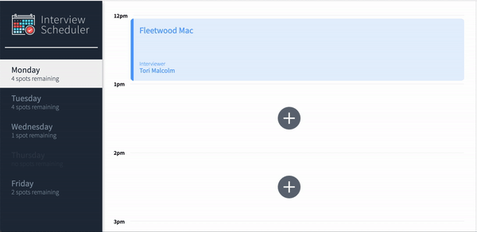

# Interview Scheduler
Interview Scheduler is a single page application built using React. It allows the user to book, edit, and delete appointments without being redirected to multiple web pages. 

The data is fetched and stored with a PostgreSQL database.

## Final Product




## Setup

Install dependencies with `npm install`.
- axios
- classnames
- normalize.css
- react
- react-dom
- react-scripts


## Running Webpack Development Server

```sh
npm start
```

## Running Jest Test Framework

```sh
npm test
```

## Running Storybook Visual Testbed

```sh
npm run storybook
```
